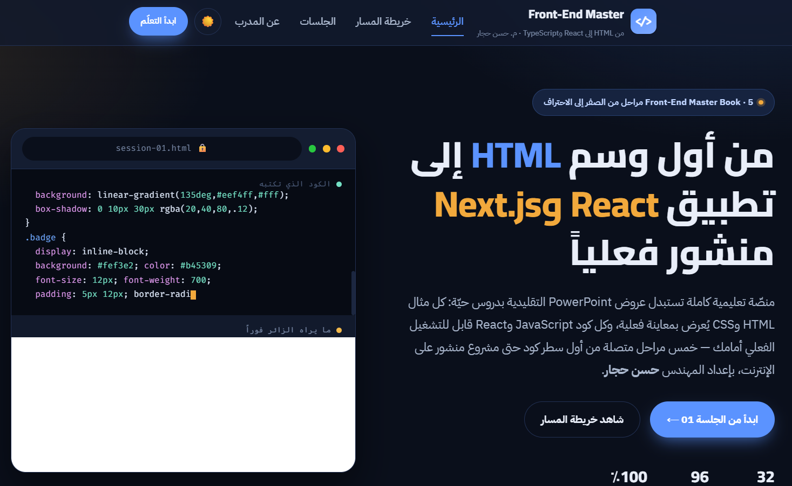
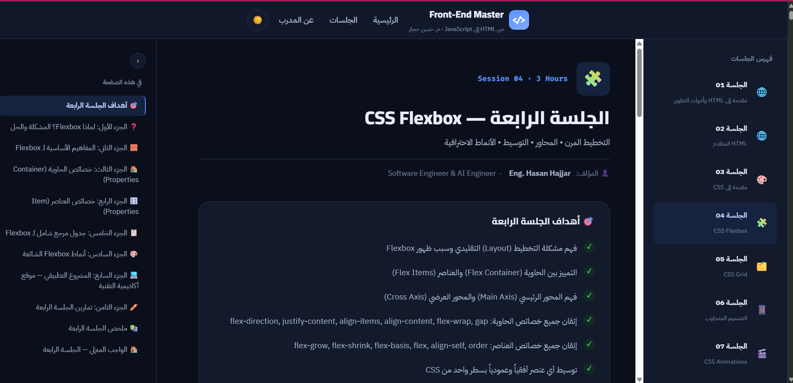

<div align="center">

# 🚀 Front-End Master Book

### من أول وسم `<html>` إلى تطبيق React وNext.js وTypeScript منشور فعلياً

**منصّة عربية تفاعلية كاملة لتعلّم تطوير الويب من الصفر — بديل حقيقي عن عروض PowerPoint**

<br/>


-critical?style=flat-square)


<br/>

**[📖 تصفّح خريطة المسار](#-خريطة-المسار-الكامل) · [🚀 البدء السريع](#-البدء-السريع) · [🛠️ التقنيات](#️-التقنيات-المستخدمة) · [👨‍💻 عن المؤلف](#-عن-المؤلف)**

</div>

---

## 📸 لمحة سريعة

<div align="center">
<table>
<tr>
<td width="50%"></td>
<td width="50%"></td>
</tr>
<tr>
<td align="center"><sub>الصفحة الرئيسية — خريطة مسار تفاعلية بخمس مراحل</sub></td>
<td align="center"><sub>صفحة درس — معاينة حيّة + فهرس "في هذه الصفحة"</sub></td>
</tr>
</table>
</div>

---

## 📚 عن المشروع

**Front-End Master Book** ليس مجرد موقع تعليمي — إنه تحويل كامل لسلسلة محاضرات حقيقية (عروض PowerPoint أصلية للمهندس حسن حجار) إلى منصّة ويب تفاعلية حيّة. كل جلسة تحافظ على نفس المحتوى والترتيب والأهداف التعليمية للنسخة الأصلية، لكنها الآن:

- 🖥️ **حيّة، لا شرائح ثابتة** — كل مثال HTML/CSS يُعرض بمعاينة فعلية داخل الصفحة
- ▶️ **قابلة للتشغيل** — كل كود JavaScript قابل للتنفيذ الفعلي أمام الطالب، بضغطة زر
- 📱 **متجاوبة بالكامل** — تجربة احترافية على الحاسوب واللوحي والجوال على حدٍّ سواء
- 🌙 **بوضعين** — ليلي ونهاري، مع حفظ تفضيل الطالب
- 📊 **تتبّع تقدّم حقيقي** — كل طالب يرى تقدّمه الفعلي عبر الجلسات محفوظاً محلياً في متصفحه

المشروع مبني بالكامل بـ **HTML وCSS وJavaScript خالص** لمساري HTML/CSS وJavaScript (بلا أي إطار عمل أو مكتبة خارجية)، بينما تستخدم جلسات React وNext.js وTypeScript الأدوات والمكتبات الفعلية التي تُدرَّس فيها.

---

## ✨ المزايا

| الميزة | الوصف |
|---|---|
| 🗺️ **خريطة مسار بصرية** | خمس محطات مترابطة تعرض الرحلة الكاملة بنظرة واحدة، قابلة للضغط للانتقال المباشر |
| 👁️ **معاينة حيّة** | أكواد HTML/CSS تُعرَض في iframe حقيقي، لا لقطات شاشة |
| ▶️ **تشغيل فعلي للكود** | أكواد JavaScript الخالصة قابلة للتنفيذ في بيئة معزولة (Sandboxed Console) |
| 🧠 **اكتشاف ذكي لنوع الكود** | يميّز تلقائياً بين JavaScript القابل للتشغيل، وJSX/React/TypeScript غير القابل للتنفيذ المباشر، فلا يعرض أزراراً مضلِّلة |
| 📑 **فهرس "في هذه الصفحة"** | تنقّل ذكي داخل كل درس، مع تظليل تلقائي للقسم الحالي أثناء التمرير (Scroll Spy)، وقابل للطي |
| 📈 **تتبّع التقدّم** | شريط تقدّم عام + لكل جلسة، محفوظ في `localStorage` |
| 🌗 **وضع ليلي/نهاري** | تبديل فوري مع حفظ التفضيل |
| 📱 **تصميم متجاوب** | من الجوال (375px) حتى الشاشات فائقة العرض (1920px+) |
| 🔤 **عربي RTL بالكامل** | تصميم وتخطيط مبنيّان من الأساس لدعم العربية، لا ترجمة لاحقة |

---

## 🗺️ خريطة المسار الكامل

**32 جلسة تفاعلية · 96 ساعة تدريب · 5 مراحل متكاملة**

| # | المرحلة | الجلسات | الساعات | ستكون قادراً على |
|---|---|:---:|:---:|---|
| 1 | 🌐 **HTML &amp; CSS** | 01–08 | 24 | بناء صفحات ويب احترافية متجاوبة من الصفر |
| 2 | ⚡ **JavaScript** | 09–16 | 24 | برمجة منطق تفاعلي كامل والتعامل مع DOM وواجهات برمجية خارجية |
| 3 | ⚛️ **React &amp; Next.js** | 17–28 | 36 | بناء ونشر تطبيقات ويب حديثة كاملة على الإنترنت فعلياً |
| 4 | 🔷 **TypeScript** | 29–30 | 6 | كتابة كود أكثر أماناً وثقة بنظام أنواع صارم |
| 5 | 🎓 **التخرّج والاختبار** | 31–32 | 6 | مشروع متكامل منشور فعلياً + أساس اختبار كود احترافي (Jest) |

<details>
<summary><b>📋 اضغط لعرض تفاصيل كل جلسة (32 جلسة)</b></summary>

| الجلسة | العنوان | الجلسة | العنوان |
|:---:|---|:---:|---|
| 01 | مقدمة إلى HTML وأدوات التطوير | 17 | مقدمة إلى React |
| 02 | HTML المتقدم | 18 | React State وuseState Hook |
| 03 | مقدمة إلى CSS | 19 | useEffect Hook والتعامل مع Side Effects |
| 04 | CSS Flexbox | 20 | useRef وCustom Hooks |
| 05 | CSS Grid | 21 | useContext وإدارة الحالة المشتركة |
| 06 | التصميم المتجاوب (Responsive Design) | 22 | React Router — التنقل بين الصفحات |
| 07 | CSS Animations | 23 | Nested Routes وLayouts في React Router |
| 08 | المشروع الشامل (Git وGitHub Pages) | 24 | الأداء في React — memo وuseMemo وuseCallback |
| 09 | مقدمة إلى JavaScript | 25 | useReducer — إدارة حالة معقدة |
| 10 | JavaScript والـ DOM | 26 | مقدمة إلى Next.js |
| 11 | المصفوفات والكائنات المتقدمة | 27 | Next.js المتقدم — Data Fetching وAPI Routes |
| 12 | البرمجة غير المتزامنة | 28 | النشر على Vercel ومراجعة شاملة |
| 13 | التخزين المحلي في المتصفح | 29 | مقدمة إلى TypeScript |
| 14 | البرمجة الكائنية OOP | 30 | TypeScript المتقدم — Generics وUtility Types |
| 15 | JavaScript المتقدم | 31 | مشروع التخرّج الشامل (React + Next.js + TypeScript) |
| 16 | مراجعة JavaScript الشاملة والمشروع النهائي | 32 | اختبار الكود — Jest وReact Testing Library |

</details>

---

## 🛠️ التقنيات المستخدمة

<div align="center">

| المسار | التقنيات |
|---|---|
| **الموقع نفسه** |    |
| **جلسات React/Next.js** |    |
| **جلسات TypeScript** |  |
| **الاختبار** |   |
| **النشر** |   |

</div>

**بلا أي Build Step لموقع الدروس نفسه** — ملفات HTML/CSS/JS خالصة، تعمل مباشرة بفتح `index.html` أو عبر أي خادم ثابت بسيط.

---

## 🚀 البدء السريع

```bash
# استنسخ المستودع
git clone https://github.com/Eng-Hasan-Hajjar/javascript-0-to-pro-website.git
cd javascript-0-to-pro-website

# شغّل خادماً محلياً بسيطاً (يُفضَّل على الفتح المباشر من القرص)
npx serve .
# أو
python3 -m http.server 8000
```

ثم افتح `http://localhost:3000` (أو المنفذ الذي يظهر) في متصفحك.

> 💡 **الفتح المباشر من القرص** (`file://`) يعمل أيضاً لتصفّح الدروس، لكن بعض ميزات المعاينة الحيّة تعمل بشكل أفضل عبر خادم محلي.

---

## 📁 هيكل المشروع

```
javascript-0-to-pro-website/
├── index.html              # الصفحة الرئيسية (خريطة المسار + شبكة الجلسات)
├── style.css                # كل التنسيقات المشتركة (نظام تصميم واحد لكل الموقع)
├── script.js                 # كل المنطق التفاعلي (انظر "الآليات التقنية" أدناه)
├── lesson-01.html … lesson-32.html   # الجلسات الـ32، مترابطة بتنقّل تسلسلي كامل
└── screenshots/              # لقطات شاشة للـ README
```

---

## 🧠 آليات تقنية جديرة بالذكر

<details>
<summary><b>👁️ لماذا بعض الأكواد لها زر "جرّب الكود" وأخرى لا؟</b></summary>
<br/>

الموقع يكتشف تلقائياً ما إذا كانت كتلة كود JavaScript **قابلة للتنفيذ فعلياً** في متصفح عادي عبر `new Function()`، ويُخفي زر التشغيل عن أي كود يحتاج بيئة غير متوفرة في متصفح خالٍ من أدوات:

- **JSX** (وسوم React) — تحتاج Babel للتحويل
- **React Hooks** (`useState`, `useEffect`...) — تحتاج بيئة React كاملة
- **صيغ الوحدات** (`export`, `import`, `await` على المستوى الأعلى) — خاصة بأنظمة الوحدات (Modules)
- **رموز Jest/Node** (`test`, `expect`, `require`, `module.exports`, `process.env`) — خاصة ببيئة تشغيل الاختبارات لا المتصفح

هذا يمنع تجربة مستخدم مضلِّلة (زر "تشغيل" يظهر خطأً دائماً)، ويحافظ على مصداقية الأداة.
</details>

<details>
<summary><b>📑 كيف يعمل فهرس "في هذه الصفحة"؟</b></summary>
<br/>

يُبنى تلقائياً وقت التحميل بقراءة عناوين الأجزاء الفعلية من الصفحة (لا بيانات مُكرَّرة يدوياً)، ويستخدم `IntersectionObserver` (واجهة متصفح أصلية) لتظليل الجزء الحالي أثناء التمرير — بلا أي مكتبة خارجية. حالة الطي/الفتح تُحفَظ في `localStorage`.
</details>

<details>
<summary><b>🖼️ كيف تعمل المعاينة الحيّة لأكواد HTML/CSS؟</b></summary>
<br/>

كل زوج كود HTML+CSS متجاور في نفس الدرس يُدمَج وقت الضغط على "معاينة" ويُحقَن في `iframe.srcdoc` — معاينة حقيقية، لا صورة أو محاكاة.
</details>

---

## 🤝 المساهمة

هذا المشروع تعليمي بالدرجة الأولى. الاقتراحات والإبلاغ عن الأخطاء مرحَّب بها عبر [Issues](https://github.com/Eng-Hasan-Hajjar/javascript-0-to-pro-website/issues).

## 📄 الترخيص

لم يُحدَّد ترخيص بعد لهذا المستودع. جميع الحقوق محفوظة للمؤلف ما لم يُنصّ على خلاف ذلك — يُنصَح بإضافة ملف `LICENSE` يعكس رغبتك (مثل MIT للاستخدام التعليمي المفتوح، أو ترخيص أكثر تقييداً إن رغبت بحصر الاستخدام).

---

## 👨‍💻 عن المؤلف

<div align="center">

### Eng. Hasan Hajjar — م. حسن حجار
**Software Engineer & AI Engineer**

مؤلّف سلسلة **Front-End Master Book** الكاملة — من فكرة استبدال عروض PowerPoint التقليدية، إلى منصّة تفاعلية متكاملة تُدرِّس تطوير الويب الحديث بالعربية من الصفر وحتى React وNext.js وTypeScript.

</div>

---

<div align="center">

**⭐ إن أعجبك المشروع، لا تنسَ دعمه بنجمة على GitHub ⭐**

<sub>© 2026 Front-End Master Book — Eng. Hasan Hajjar</sub>

</div>